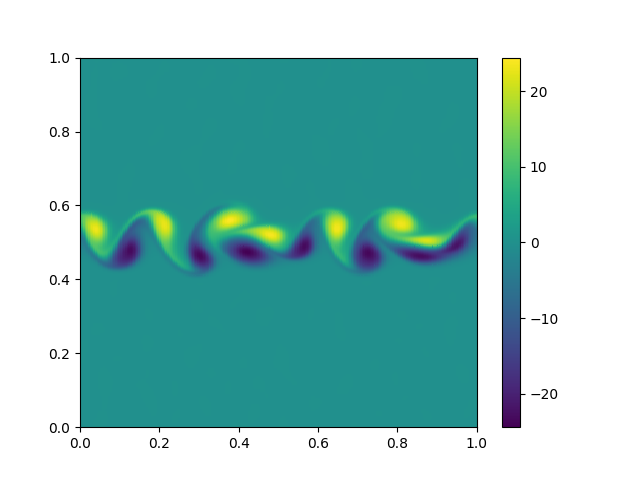

# README #

* 2D FDM scripts for studying different discretizations.
* I use these mostly for studying the effect of grid stretching on the accurarcy of different schemes.
* To run 

    cd solvers
    python 2d_navier_stokes.py

### Contact ###

* Petteri Peltonen petteri.peltonen@aalto.fi
